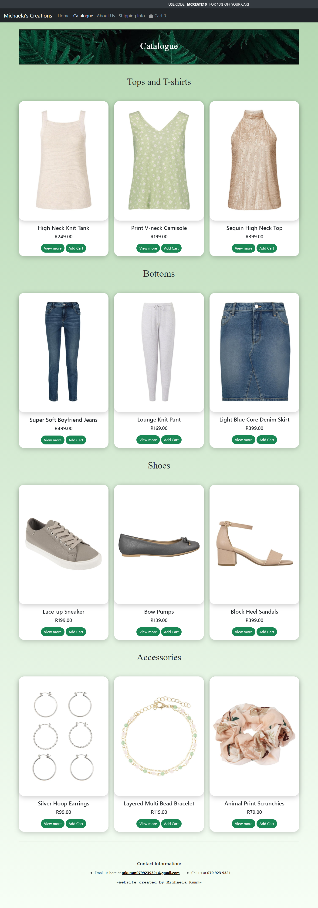
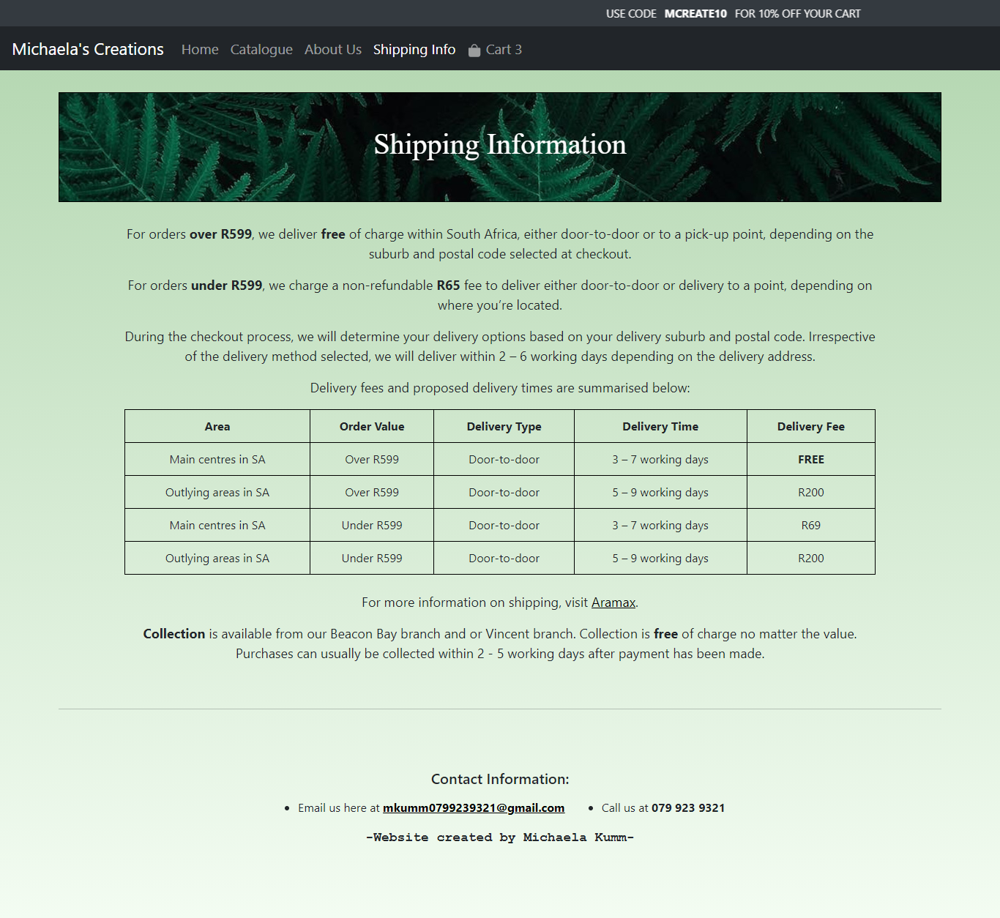
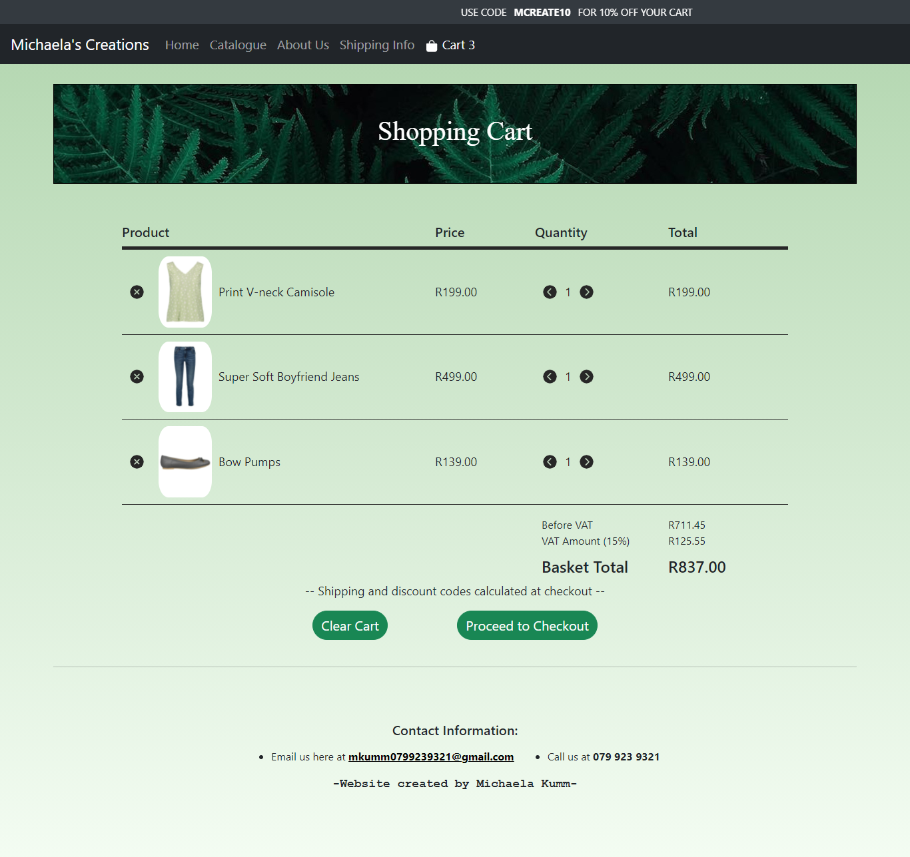

# My-Online-Store
|	Table of contents			|
|	:------------------------------:	|
|	[Description](#description)		|
|	[What it can do](#what-it-can-do)	|
|	[Layout](#layout)			|
|	[Built with](#built-with)		|
|	[Installation](#installation)		|
|	[Authors](#authors)			|

<a href="#" id="description"></a>
## 🧐 Description
This project is a Capstone Project which resembles an online store for woman's clothing, shoes and accessories. This project has a "Home" page, a "Catalogue" page, an "About Us" page, a "Shipping Information" page and a "Cart" page. As well as separate "Product Description" pages for each item and a Checkout page. 

<a href="#" id="what-it-can-do"></a>
## 🚀 What it can do
This project allows you to view more details about an item by clicking on the "View More" button and you are able add items to your cart from both the catalogue page and from the product details page, and have each item shown in your cart. You are also able to increase and decrease the quantity of an item from the "Cart" page or remove items as a whole, or even clear the entire cart. The number of items in your cart are shown in the navbar and when items are added, the number shown in the navbar is updated and there is a alert that shows your current total. The "Checkout" page is where discounts can be applied and where shipping is calculated. It also showns a cart summary and an overall total.

<a href="#" id="layout"></a>
## 💻 Layout
### Home

### Catalogue

### About Us

### Shipping Information

### Cart


<a href="#" id="built-with"></a>
## 👩‍💻 Built with
- HTML
- CSS
- JavaScript
- JQuery

<a href="#" id="installation"></a>
## 🛠️ Installation
1. Create a new repository on GitHub
2. On the command line, make a "bare" clone of the repository using the external clone URL
	```shell
	# Make a bare clone of the external repository in a local directory
	$ git clone --bare https://github.com/michaelakumm/My-Online-Store.git
	```
3. Push the locally cloned repository to GitHub using the "mirror" option
	```shell
	# Pushes the mirror to the new GitHub repository
	$ cd My-Online-Store.git
	$ git push --mirror https://github.com/(your user name)/My-Online-Store.git
	```
4. Remove the temporary local repository.
	```shell
	$ cd ..
	$ rm -rf My-Online-Store.git
	```

<a href="#" id="authors"></a>
## 👤 Authors
**Michaela Kumm**
- GitHub: [@michaelakumm](https://github.com/michaelakumm)
- LinkedIn: [@michaela-kumm-b0111a21b](https://www.linkedin.com/in/michaela-kumm-b0111a21b/)
